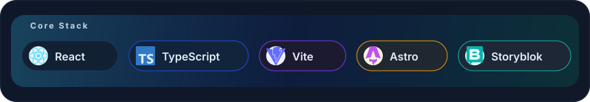

# Ilias Almerekov

**Frontend Engineer | AI Engineering Workflows**

[DE](./README.md) | [EN](./README.en.md)

Entwicklung wartbarer Frontends mit React und TypeScript, kombiniert mit AI-gestuetzten Engineering-Workflows, Architekturdenken und hoher Delivery-Qualitaet.

[GitHub](https://github.com/IliasAlmerekov) · [LinkedIn](https://www.linkedin.com/in/ilias-almerekov-4b94622bb) · [E-Mail](mailto:ilyasalmerekov@gmail.com)

---

## Kurzprofil

Frontend-fokussierter Software Engineer mit praktischem Schwerpunkt auf React, TypeScript, Vite, UI-Umsetzung, Testing und produktionsnahen Engineering-Standards.

Parallel dazu arbeite ich mit Claude und Codex an agentischen Workflows: Rollen definieren, Agenten auf den Stack ausrichten, Aufgaben in Phasen strukturieren und Implementierung reviewbar orchestrieren.

## Core Stack

  

## Engineering Signals

## Fokus

| Bereich | Schwerpunkt |
| --- | --- |
| Frontend Engineering | Wartbare React- und TypeScript-Anwendungen, responsive UI, saubere Komponenten- und Projektstruktur |
| AI Engineering | Agentenkonfiguration, Rollendesign, Multi-Agent-Orchestrierung, repository-aware Workflows |
| Architektur | C4, Data Flow, Use Cases, phasenbasierte Analyse und Delivery-Planung |
| Quality | Testing, Linting, CI/CD, Reviewbarkeit, Dokumentation und stabile Engineering-Standards |

## Ausgewaehlte Projekte

| Projekt | Wofuer es steht | Stack |
| --- | --- | --- |
| [darts](https://github.com/IliasAlmerekov/darts) | Frontend-Architektur, Testing-Disziplin, PWA-Flow, DX | React, TypeScript, Vite, Vitest, Playwright |
| [swiftly](https://github.com/IliasAlmerekov/swiftly) | Produktdenken, Full-Stack-Integration, saubere Frontend-Umsetzung | React, TypeScript, Node.js |
| [swiftly-backend](https://github.com/IliasAlmerekov/swiftly-backend) | API-Struktur, Contract Testing, Middleware, produktionsnahe Backend-Praxis | Node.js, Express, Redis, MongoDB, Docker |

## Recent Work

- Aufbau eines React- und TypeScript-basierten PWA-Projekts mit Vitest, Playwright und klaren Quality Gates.
- Arbeit mit agentischen Workflows fuer Research, Review, Testing und Implementierung.
- Vertiefung von Backend-Praxis in Node.js und Symfony sowie besseres Verstaendnis von API- und Delivery-Themen.

## GitHub Snapshot

  

